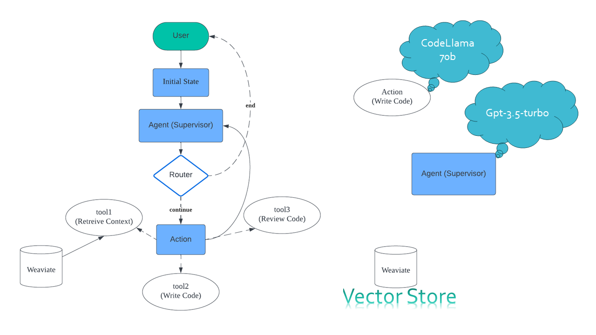

# Code Generation Project using GPT-3.5 and CodeLlama

## Overview
This project utilizes GPT-3.5 and the CodeLlama model in a cloud environment for code generation. It incorporates langchain, langgraph, and the Weaviate vector store for language understanding, relationship mapping, and vector representation.

## Features
- Utilizes GPT-3.5 and CodeLlama model for code generation
- Implements langchain and langgraph for language relationship mapping
- Integrates Weaviate vector store for vector representation

## Installation
1. Clone the repository: `git clone https://github.com/your-repo.git`
2. Install dependencies: `npm install`

## Usage
1. Configure the necessary API keys for GPT-3.5, CodeLlama, and Weaviate in the environment variables.
2. Run the project: `node app.js`

## Contributing
Contributions are welcome! Please follow the [Contribution Guidelines](CONTRIBUTING.md).

## License
This project is licensed under the MIT License - see the [LICENSE](LICENSE) file for details.

